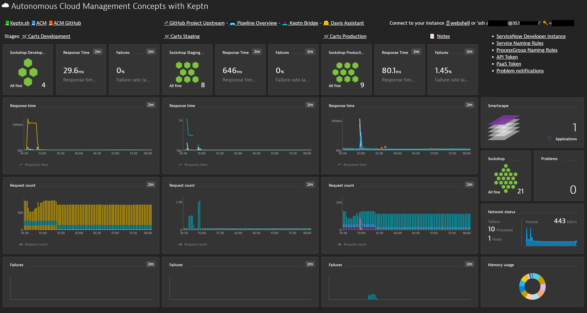
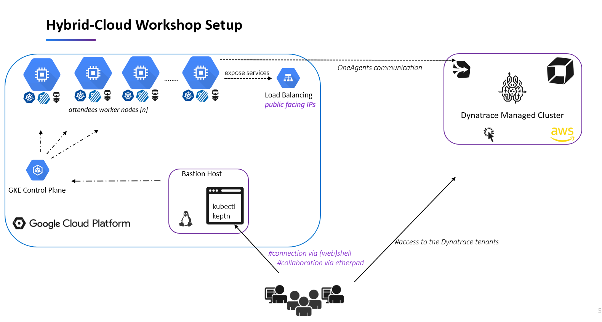

# 💻 ☁ Autonomous Cloud Workshop Instructions

> Let's **release better software faster** and put your IT on Autopilot with Keptn and Dynatrace. 
> Let's build a Software delivery pipeline from scratch with quality gates and self-healing!

# Overview
In this workshop, you will get hands-on experience with Dynatrace and the open source framework [Keptn](https://keptn.sh) and see how it can help you to manage your cloud-native applications on Kubernetes.
In this workshop everything is already set up for the attendees.

> This is the preconfigured Dashboard of each attendee where he can get an overview of the three stages (dev, staging, prod) of the  service being delivered and tested with Keptn, its Quality Gates (Lighthouse) and Kubernetes. 

## The Hybrid-Cloud Workshop Setup

# The Workshop in a Nutshell
## 1. 🤖 Monitoring as a Service 
We will deploy the oneagent in the Kubernetes cluster via the OneAgent Operator. We will notice the importance of tagging, filtering and automating via the Dynatrace API. Each attendee gets a predefined custom dashboard so they are able to observe how the services are automatically deployed in the three stages (development, staging and production).

## 2. 🚚 Automate Delivery 
With Keptn the three stages are created when we define the Shipyard file. The service will be shipped to these stages with the deployment strategy defined in each stage. We analyze the events on Dynatrace and we stress on the important of feedback leveraging RequestAttributes. 

## 3. 💎 Automate Quality 
We add an SLO and SLI (Service Level Indicator and Service Level Objective) and we see how a bad build is rolledback in Staging.

## 4. 🚑 Incident Management, Self-Healing and Runbook Automation 
A problem is in production detected and it will be automatically repaired via Runbook automation with a Service-Now workflow. 

# Hands-on Labs 👩‍💻👨‍🔬

## [Hands-On during the workshop (interactive)](./resources)
The Hands-On Workshop was delivered in an interactive way collaborating with [Etherpad](https://etherpad.org/) on the Bastion Host. A copy of the cheatsheet can be found here [resources](./resources) In here you'll also find the shell scripts that were executed for deploying Dynatrace, configuring Keptn and going in a fast way through the below Steps (1-5) which allows us to have more time for understanding what is happening under the hood changing to the presentation being displayed.

## Hands-On for follow-up 
The below steps are based on each other, so it is important to complete them according to this order:

1. Install Keptn and deploy dynatrace: [Lab](./00_Install_keptn_deploy_dynatrace)
2. Onboarding the carts service: [Lab](./01_Onboarding_carts_service)
3. Deploying the carts service: [Lab](./02_Deploying_the_carts_service)
4. Introducing quality gates: [Lab](./03_Introducing_quality_gates)
5. Runbook Automation: [Lab](./04_Runbook_automation)

# Keptn Community 📢

Join the Keptn community!

Further information about Keptn you can find on the [keptn.sh](keptn.sh) website. Keptn itself lives on [GitHub](https://github.com/keptn/keptn).

**Feel free to contribute or reach out to the Keptn team using a channel provided [here](https://github.com/keptn/community)**.

Join our Slack channel!

The easiest way to get in contact with Keptn users and creaters is to [join our Slack channel](https://join.slack.com/t/keptn/shared_invite/enQtNTUxMTQ1MzgzMzUxLTcxMzE0OWU1YzU5YjY3NjFhYTJlZTNjOTZjY2EwYzQyYWRkZThhY2I3ZDMzN2MzOThkZjIzOTdhOGViMDNiMzI) - we are happy 😀 to meet you there!
